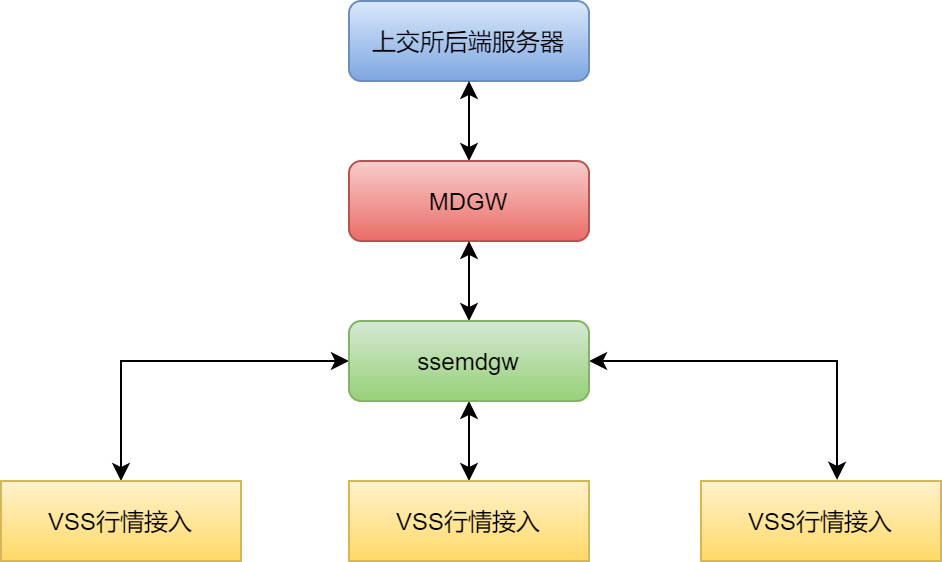
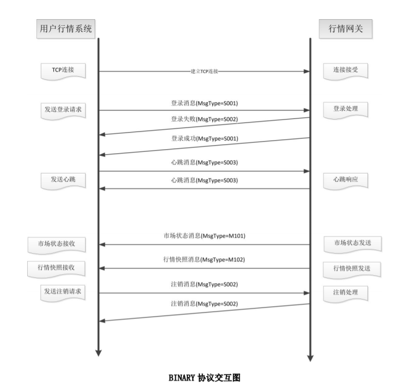
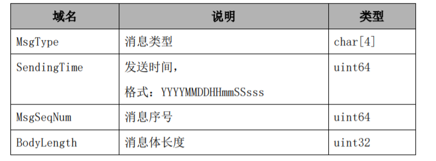
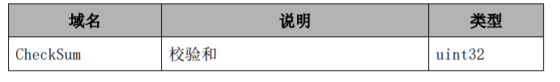
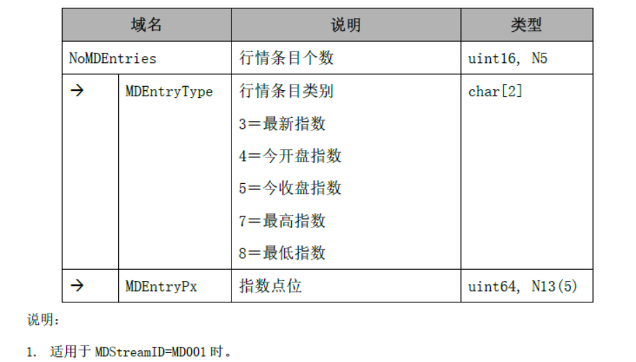
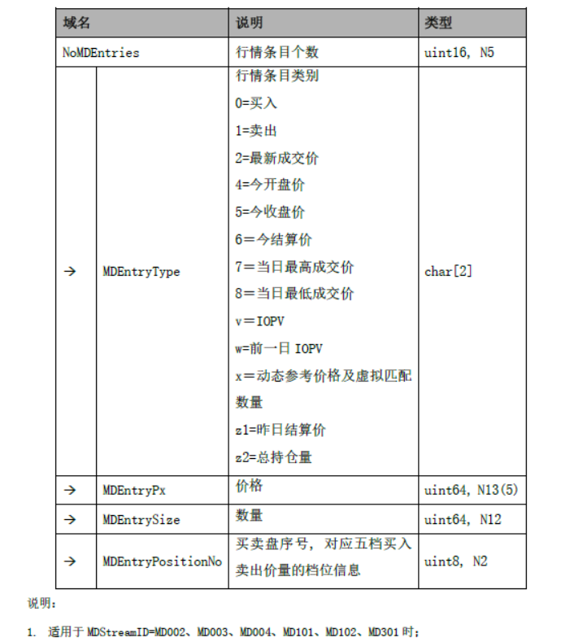

# 1、说明

本项目是上交所流行情MDGW网关接入解析程序，通过Go语言实现。

上交所通过EzSR和MDGW发布Level1行情，后续会逐步转向MDGW流模式行情。

## 1.2 MDGW行情网关

MDGW（Market Data GateWay）行情网关，固定提供行情任务和文件任务。对于行情接收任务，以Binary或者STEP接口规范进行转发，也可以选择是否落地mktdt格式的行情文件。技术架构如下：


## 1.3 为什么用Go语言

笔者最近在学习Go语言，学习编程最好的方法就是去实践，在这个过程中”踩坑“和实现各种需求是最”便捷“的一条路。Just Do Coding!


# 2、功能

## 2.1 基本功能

ssemdgw实现的主要功能有：

- 连接MDGW行情网关，完成会话；
- 根据binary接口规范完成行情数据的接收和解析；
- 行情转发，当其他VSS连接ssemdgw之后，ssemdgw会转发行情数据。

## 2.2 基本架构

ssemdgw基本架构如下：




## 2.3 基本模块

（1）系统配置

​	配置MDGW地址和端口；

​	配置本地监听端口，等待其他VSS进行连接。

（2）socket连接

​	ssemdgw启动之后，根据配置的MDGW地址和端口连接MDGW网关；

   根据协议规范建立会话。

（3）会话管理

​	ssemdgw建立会话之后，如果因为网络或者MDGW故障会话断开，可以根据配置的时间间隔重新连接。

（4）数据接收和解析

​	接收MDGW发送的数据，按照接口规范进行解析。

（5）数据保存

​	对于接收到的数据保存原始以及解析后的明文数据。

（6）行情转发

​	其他行情接收模块连接ssemdgw之后，ssemdgw会转发收到的行情数据。


# 3、基本设计  

## 3.1 配置读取

### 3.1.1 格式

​	json格式，通过Go语言自带的encoding/json解析和处理；

​	定义结构体:

```go

type SysConf struct {
    Gatewayip   string `json:"GateWayIP"`
    Gatewayport int    `json:"GateWayPort"`
    Localip     string `json:"LocalIP"`
    Localport   int    `json:"LocalPort"`
    Backdir     string `json:"BackDir"`
}
```


## 3.2 会话管理

https://www.infoq.cn/article/boeavgkiqmvcj8qjnbxk


### 3.2.1 连接MDGW网关

（1）连接过程

- 通过TCP协议连接MDGW网关， ssemdgw发起TCP请求，如果连接失败，等待配置时间间隔后重新连接；

- 如果TCP连接建立之后因网络问题出现中断，也等待配置时间间隔后重新发起连接；
- 或者在配置的时间内收不到消息。

（2）配置项

- 超时时间（timeout），TCP接收超时时间配置；
- 连接时间间隔（conn_inteval），重新发起连接的间隔时间。

（3）实现方法

​	通过golang语言net库实现连接。

### 3.2.2 通信协议

​	MDGW行情网关协议如下：



（1）登录过程

- ssemdgw完成TCP连接之后，发送登录消息，然后接收登录验证消息，如果验证失败（可能是由于用户名、密码等验证错误），解析注销消息获取原因；
- 如果登录成功，解析登录成功消息。

（2）心跳消息

- 用于监控通信连接的状况；
- 当连接的任何一方在心跳时间间隔（由 HeartBtInt 域指定）时间内没有接收或发送任何数据的时候，需要产生一个心跳消息并发送出去；
- 如果接收方在 2 倍心跳时间间隔内都没有收到任何消息的时候，那么可认为行情会话出现异常，可以立即关闭 TCP 连接。

（3）注销消息

- 发起或者确认行情会话终止；
- 未经注销消息交换而断开连接，一律视为非正 常的断开。

（4）消息组成

- 每条消息有消息头、消息体和消息尾组成，消息最大长度为8K字节。
-  头部格式：



- 消息尾:




（5）消息验证算法

```c
uint32 CalcChecksum(const char* buffer, uint32 len)
{
 uint8 checksum = 0;
 uint32 i = 0;
 for (i = 0; i < len; i++)
 {
 checksum += (uint8)buffer[i];
 }
 return (uint32)checksum;
}
```


### 3.2.3 主要消息体结构设计

（1）消息字段类型	

参照《规范》中的消息字段的类型：

| 类型      | 说明                                                         |
| --------- | ------------------------------------------------------------ |
| char[x]   | 代表该字段为字符串，x 代表该字符串的最大字节数，x 为 大于零的数字，例如 char[5]代表最大长度为 5 字节的字符串；当最大长度大于实际长度时，右补空格。字符串使用 GBK 编码 |
| int,uint  | 代表该字段为整型数值，如 uint32 表示 32 位无符号整数， int64 表示 64 位有符号整数 |
| Nx、Nx(y) | 与 int、uint 一并使用，用于给出该整型数值实际表示的业 务字段的长度（精度）: Nx 代表最大长度为 x 位数字的整数；Nx(y)代表最大长度为 x 位数字，其中最末 y 位数字为小数部分 |

其中，Nx(y)解析之后需要进行转换。

（2）golang内置类型

有对应的byte、int/uint8、int/uint16、int/uint32、int/uint64。

（3）主要消息类型定义

```go

const LoginMsgType = "S001"
const LogoutMsgType = "S002"
const HBMsgType = "S003"

type MsgHeader struct {
    msgType [4]byte
    SendingTtime uint64
    MsgSeq uint64
    BodyLength uint32
}

type MsgTail struct {
    CheckSum uint32
}

//登录消息
type LoginMsg struct {
    Header MsgHeader
    SenderCompID    [32]byte
    TargetCompID    [32]byte
    HeartBtInt      uint16
    AppVerID        [8]byte
    Tail MsgTail
}

//注销消息
type LogoutMsg struct {
    Header MsgHeader
    SessionStatus uint32
    Text    [256]byte
    Tail MsgTail
}

//心跳消息
type HeartBtMsg struct {
    Header MsgHeader
    Tail MsgTail
}

//市场状态消息
type MktStatusMsg struct {
    Header MsgHeader
    SecurityType uint8
    TradSesMode uint8
    TradingSessionID [8]byte
    TotNoRelatedSym uint32
    Tail MsgTail
}

//行情快照
type SnapMsg struct {
    Header MsgHeader
    SecurityType uint8
    TradSesMode uint8
    TradeDate uint32
    LastUpdateTime  uint32
    MDStreamID [5]byte
    SecurityID [8]byte
    Symbol [8]byte
    PreClosePx uint64
    TotalVolumeTraded uint64
    NumTrades uint64
    TotalValueTraded uint64
    TradingPhaseCode [8]byte
}

//指数行情快照
//根据条目个数需要进行扩展
type IndexSnap struct {
    SnapData SnapMsg
    NoMDEntries uint16
    MDEntryType [2]byte
    MDEntryPx uint64
}

//竞价行情快照
type BidSnap struct {
    SnapData SnapMsg
    NoMDEntries uint16
    MDEntryType [2]byte
    MDEntryPx uint64
    MDEntrySize uint64
    MDEntryPositionNo uint8
}


```


根据接口规范，指数行情和竞价行情有扩展字段，不同类型设置“行情条目个数”，根据行情条目个数确定消息的长度。


## 3.3 socket接入

ssemdgw通过TCP协议进行连接，并设置socket超时时间。采用Golang的标准库net。

### 3.3.1 结构体设计

```go
type MdgwSock struct {
    laddr, raddr *net.TCPAddr
    lconn, rconn io.ReadWriteCloser
}
```

 ### MDGW连接

通过```Dial``` 函数发起tcp连接。


### 登录验证

创建消息之后，通过tcp进行发送登录消息，如果发送失败，返回等待下次重新连接，如果发送成功，等待接收反馈，如果等待接收超时，返回等待下次重新连接。


### 验证登录返回消息

如果验证失败，程序退出。


## 3.4 数据接收和解析

会话建立之后行情服务器发送数据，通过Buffer接收缓存。

然后判断是否收到完整的数据包，如果没有收到继续接收数据；

收到完整数据包之后，基于数据包格式解析Buffer中内容。

### 3.4.1 数据接收

从socket读取之后，放入到Buffer中。

### 3.4.2 完整数据包判断

先判断长度是否大于等于数据包头部；

然后根据头部中数据包长度，检查buffer中是否缓存了

### 3.4.3 数据包校验

针对完整的一个数据包，通过规范中数据包校验算法进行校验。

### 3.4.4 数据包解析

取出数据包头部，根据消息类型解析不同的消息类型。


## 3.5 数据保存

对于接收的原始二进制数据和解析后的数据按照文件方式进行保存。

### 3.5.1原始数据

接收的原始数据包，按照二进制方式进行保存。

### 3.5.2 解析后数据

对于解析后的数据按照文件方式进行保存，保存格式如下：

时间、代码、最新价格、成交量、成交金额、交易状态


## 3.6 行情转发

连接交易所MDGW网关之后，实时接收数据，保存最新的快照数据。其他行情模块连接之后，先发送最新的快照数据，然后实时转发从MDGW接收的快照行情。

### 3.6.1 socket监听

在配置端口进行socket监听，等待下游VSS程序接入。

### 3.6.2 会话处理

下游VSS程序接入之后，通过epoll方式进行处理。

### 3.6.3 行情转发

从MDGW接收到行情之后，基于公平队列的方式，向连接的VSS程序发送行情数据包。


## 3.7 心跳消息

按照接口规范，连接双方在数据发送的空闲期间应主动发送心跳消息，通过心跳消息可以监控行情会话的状态。

按照定时周期发送发送，如果VSS超过两个HeartBtIntl指定的周期内没有收到MDGW发送的消息，则会话被认为是可能存在异常，VSS需要重新建立行情会话。

### 3.7.1 心跳发送goroutine

通过goroutine按照周期向MDGW发送心跳消息。连接建立成功之后，间隔发送。考虑到后续发送注销消息等的逻辑和心跳发送时分开的，因此需要注意socket写入的“同步”。


## 3.8 会话关闭

MDGW会主动断开与VSS之间的连接。

- MDGW与交易所主机连接异常；
- VSS未能及时处理MDGW发送的数据，导致MDGW内积压的待发送消息超过特定阈值。


# 4 goroutine

MDGW程序通过多个goroutine完成接收和解析工作。

## 4.1 主goroutine

main函数启动运行，读取配置文件，然后连接MDGW网关、根据协议发送验证消息。如果验证失败，则程序退出。如果验证成功，则启动数据接收goroutine以及数据解析goroutine。

## 4.2 数据接收

从MDGW网关接收发送的行情数据，判断是一个完整的消息之后，放入到有缓冲的管道中。

## 4.3 数据解析

从管道接收消息之后，根据不同的消息类型进行解析。


数据接收和数据解析之间通过channel进行通信。


## 4.4 发送心跳消息

定时向socket发送心跳消息。根据MDGW协议，VSS断开连接的时候发送注销消息，需要通过sync信息“同步”访问。


# 5行情快照消息解析

行情快照用于发布证券产品行情，多条快照之间无数据依赖性，VSS无需区分全量和增量消息，直接替换当前的数据。

## 5.1 消息结构

因为证券产品行情包含了多种类型，每种类型揭示的数据字段有所差异，因此交易所在设计时采用了固定字段+扩展字段的结构。

- 固定字段：提出行情类别、产品代码、成交数量、成交金额等共同字段；
- 扩展字段：根据行情类别，组合不同的字段。

指数行情快照扩展字段为：



NoMDEtries条目字段表示了可能包含多条计算，根据不同的数目后续读取的长度不同。

集中竞价类行情快照扩展字段为：



## 5.2 解析过程

（1）从MDGW接收二进制数据之后，根据数据包头部的长度字段，判断是一个完整的数据包

（2）先读取固定字段，获取不同产品类型的共同字段

（3）数据包长度减去固定字段长度，获取扩展字段的长度

（4）从扩展字段中读取行情条目个数，然后根据指数或者竞价产品类型的字段进行读取


# 附录

[上海证券交易所 行情网关技术指引及接口开发指南](http://www.sse.com.cn/services/tradingservice/tradingtech/technical/policy/c/SSE_MDGW_Interface_0.6_20191111.pdf)

[IS120 上海证券交易所行情网关 BINARY 数据接口规范](http://www.sse.com.cn/services/tradingservice/tradingtech/technical/data/c/IS120_BINARY_Interface_CV0.42_20210315.pdf)

[golang内置类型](https://golang.org/pkg/builtin/)


